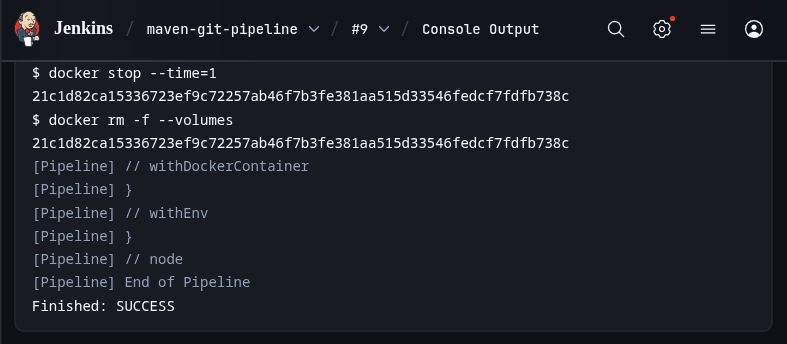
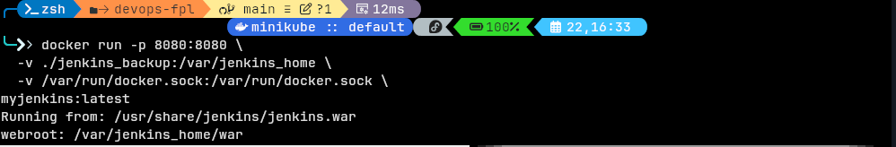
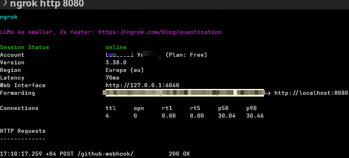
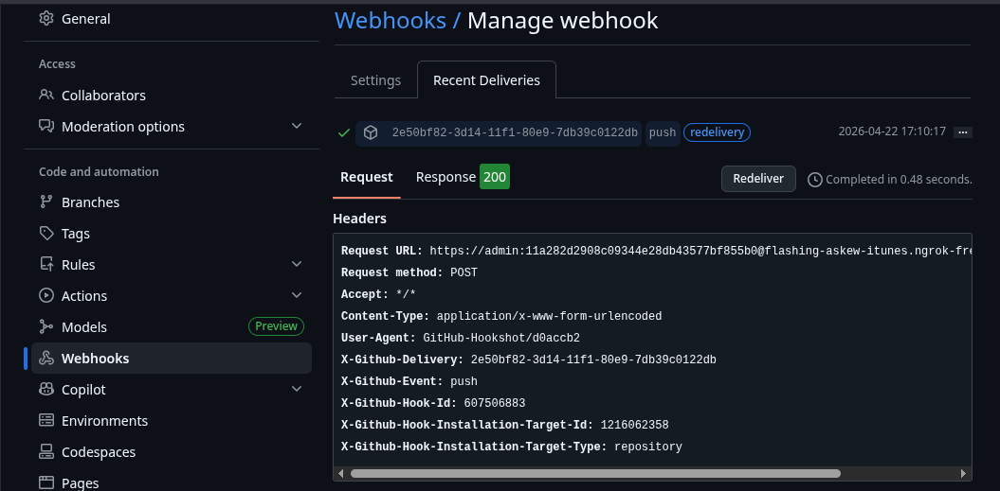

# Java Maven — CI/CD avec Jenkins

## Description
Projet Java Maven avec pipeline CI/CD Jenkins.
Build/test automatisés, déclenchés via webhooks GitHub.

## Stack utilisée
- Jenkins
- Maven
- GitHub
- Docker
- Webhooks

## Structure du repo
- `Jenkinsfile` : définition du pipeline Jenkins
- `maven/pom.xml` : configuration Maven
- `maven/src/main/java/maven/Hello.java` : code source (exemple)

## Lancer le pipeline (résumé)
1. Créer un job Jenkins (Pipeline) pointant sur ce repo GitHub.
2. Configurer le `Jenkinsfile` comme source du pipeline.
3. Ajouter un webhook GitHub vers l’URL Jenkins (`/github-webhook/`).
4. Lancer un build (push sur `main` ou bouton “Build Now”).

## Captures d’écran
<table>
	<tr>
		<td>
			<b>Jenkins (pipeline OK)</b> 
			
		</td>
		<td>
			<b>Docker (service up)</b> 
			
		</td>
	</tr>
	<tr>
		<td>
			<b>Ngrok (tunnel actif)</b> 
			
		</td>
		<td>
			<b>Webhook GitHub (déclenchement)</b> 
			
		</td>
	</tr>
</table>

## Auteur
- Lazzouzi Youssef
